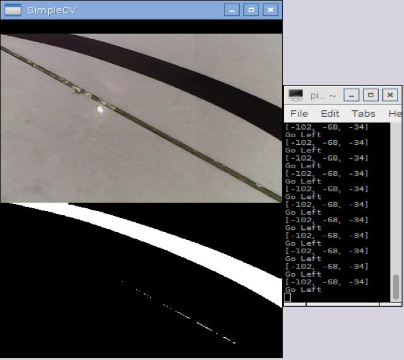
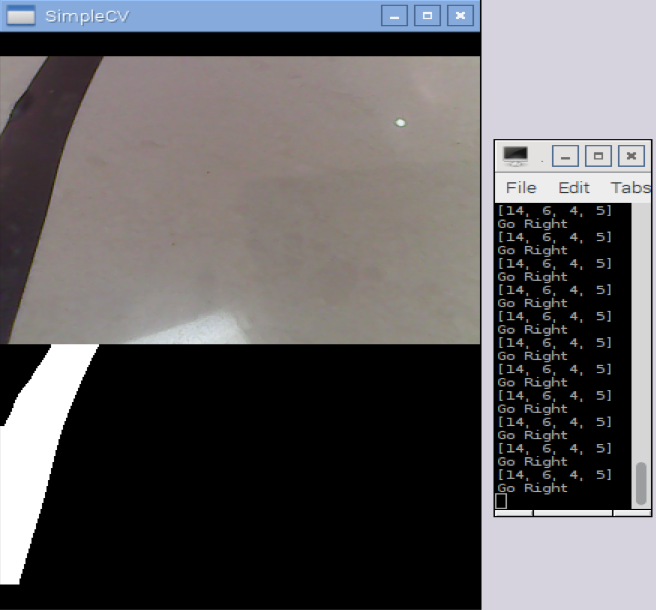
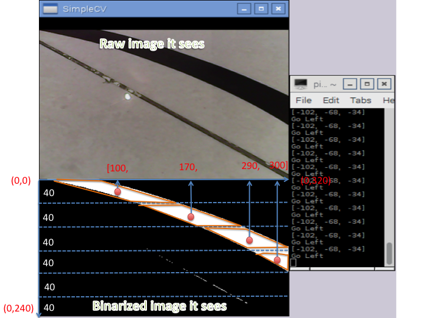

# InnovationEducation
This repo includes the material for a serial of lessons that aims for children to experience and enjoy the process of innovation. The innovation mindset we adopt is called [Inside the Box](http://www.insidetheboxinnovation.com/).
We also belive Learning by Creating - people only master a knowlege when they actually use it to create.
We also created a [video clip](http://www.bilibili.com/video/av4071891/) to explain the process. 

## Inside the Box - Box One: Future Restaurant
### 1. Introduction:
The goal is to innovate a traditional restaurant. The constrains are no waiters or waitress, nor tables, even not providing any food!! Sounds creazy? 
It turns out to be a "future restaurant". 
It is rather a playground with VR devices that Children can play, socialize with each other and have a lot of fun. Although it dose not provide any food, it does serve extremely nutritious drinks by a Robots so the children wont get disturbed. Can you imagine such restaurant, it is likely to be the trend. There are reasons,
- 1) Nowadays, kids are having too much junk food and spending too much time in doors study or playing video games. 
- 2) So they must be lacking of social activities, more and more children are overweight or lack of enougth excersise.
- 3) Such "restaurant" can be very useful and healthy for such kids.

### 2. The Robot
The technical part of the whole idea is a Robot waiter. The robot needs to look like a Creeper in Minecraft since we are love Minecraft.
The robot follows tha desigated road that is confined with two black lines, mimick like real black road confind by 2 white lines. 
The core of the robot is a Raspberry Pi computer with a USB camera, a L298N chip drives 4 motor wheels, 2 for each side. 
The software inside the Raspberry Pi will process the image taken by the camera in real time to determine go straight, to left or go right. 
This is how it looks like...

### 3. We failed millon times
This sounds easy, but we failed millon times building the robot. The solutions we tried and failed are,
- One Camera follow one line
The issue is that the motors speed cannot be accurately controlled, when the robot turns, the angel it turns is too wide so the line will be out of view very quickly, therefore, it will often gets out of control.
- Two Cameras follow one line
It seems to be very smart solution, with two eyes, it can easily determine which way to go based on which eyes sees the line or both eyes see the line. However, the problem is that with two cameras, the image process time increased significantly, the delay makes the robot to be out of control. The problem of 1) still exist.
- One Cameras follow a road confined by two lines
The idea is that if it sees nothing, it just go straight, otherwise, the robot will bounce when it sees the line. However, it is very difficult to determine which direction to do, right or left when it was going straight and suddenly sees a black line. 

### 3. Real Technology - Computer Vision with Python
- The program language is [Python](www.python.org)
- The Computer Vision library we used is called [Simple CV](http://www.simplecv.org/). 
- L298N Chip for Motors Python driver. [Code](./futureRestaurant/CreeperRobot/CreeperLegs.py).

### 4. The smart algorithm - It finally works with a improved software algorithm
1. It first takes the image from the camera. Then binarize it based on the color distance with the BLACK color.
```python
dist = img.colorDistance(Color.BLACK).dilate(2)
segmented = dist.binarize(80)
```

The following diagram shows who it works
- line pointing to left

- line pointing to right


2. It then determine the line direction
It crops the segmented image horizontally evenly into 6 parts. For each part, it looks for a blob which is a part of the black line. Based on the position of each blob, it generate an array of X value of each blobs.
Based on the delta of the X values in the array, it can then determine the trend(Left o right) of the line.
For the details please look into the [code](./futureRestaurant/CreeperRobot/CreeperOneEyeTwoLines.py).



### The video shows how the robot works 
